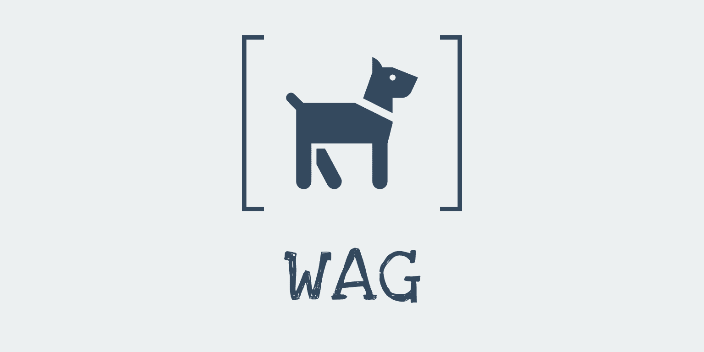

# Wag

A web based application that helps busy dog owners get their dog walked while they at work

# Features!

- Creates a Map and allow user to create a digital fence that can be saved and edited
- Dynamically draw a route based on the geotags pulled by the browser
- Allow a user to view the path when someone else is walking their dog in near real time

### Tech

Wag uses a number of open source projects to work properly:

* [ReactJS] - A JavaScript framework for building user interfaces
* [node.js] - evented I/O for the backend
* [Ant Design] - CSS Library using components for modern web appos
* [Firebase Authentication] - It provides an end-to-end identity solution, supporting email and password accounts
* [Firebase Storage] -  quickly and easily store and serve user-generated content, such as photos
* [Firebase Realtime Database] - The Firebase Realtime Database is a cloud-hosted NoSQL database that lets you store and sync data between your users in realtime.
* [Leaflet] - an open-source JavaScript library for mobile-friendly interactive maps
* [Mapbox]- Provides building blocks to add location features like maps, search, and navigation into any experience you create.
* [GeoLib] - Library to provide basic geospatial operations like distance calculation, conversion of decimal coordinates 
* [Mapquest] - Accurate geocoding API 

And of course Wag itself is open source with a [public repository][Wag] on GitHub.

###ERD


### Installation

Wag requires [Node.js](https://nodejs.org/) v4+ to run.

Install the dependencies and devDependencies and start the server.

```sh
$ cd wag
$ npm install -d
$ node app
```


[//]: # (These are reference links used in the body)


   [Wag]: <https://wag-app-d212c.firebaseapp.com>
   [git-repo-url]: <https://github.com/Sglavin85/Wag>
   [Firebase Storage]: <https://firebase.google.com/products/storage/?authuser=0>
   [Firebase Authentication]: <https://firebase.google.com/products/auth/?authuser=0>
   [Firebase Realtime Database]: <https://firebase.google.com/products/realtime-database/?authuser=0>
   [node.js]: <http://nodejs.org>
   [Ant Design]: <https://ant.design/>
   [Leaflet]: <https://leafletjs.com/>
   [Mapbox]: <https://www.mapbox.com/>
   [Geolib]: <https://www.npmjs.com/package/geolib>
   [ReactJS]: <https://reactjs.org/>
   [Mapquest]: <https://developer.mapquest.com/>
